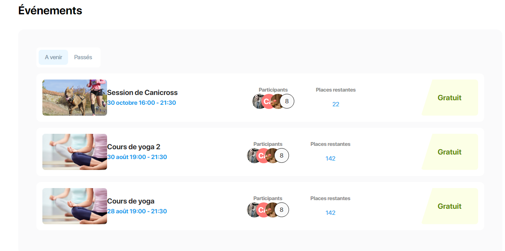
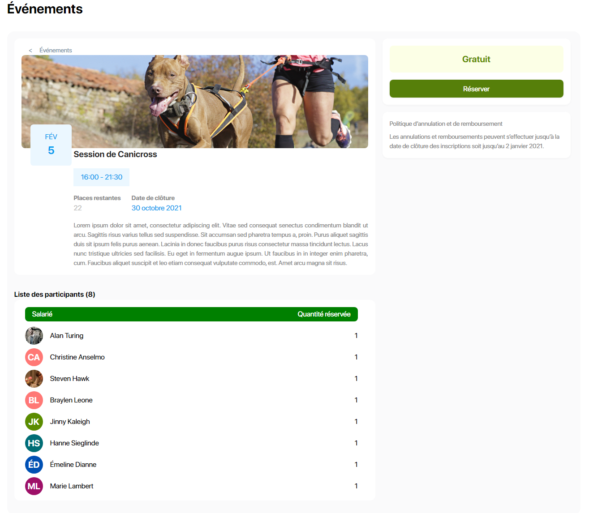

# Events React Front

This project was bootstrapped with [Create React App](https://github.com/facebook/create-react-app) using [Vite](https://github.com/vitejs/vite).

[App Live Demo](https://creative-platypus-c14039.netlify.app/)

with [Vitest](https://github.com/vitest-dev/vitest),  Jest, React Testing Library, TypeScript

This project code quality was tested with [Sonarcloud.io](https://sonarcloud.io/summary/overall?id=Webnume_Event-Front)

|                                                                                                    summary                                                                                                    |                                                                                                 score                                                                                                 |                                                                                           to do                                                                                           |
| :-----------------------------------------------------------------------------------------------------------------------------------------------------------------------------------------------------------: | :---------------------------------------------------------------------------------------------------------------------------------------------------------------------------------------------------: | :----------------------------------------------------------------------------------------------------------------------------------------------------------------------------------------: |
|                            |    |    |
|  |  |  |
|                                      |        |                                                                                                                                                                                            |
|         

## Available Scripts

In the project directory, you can run:

### `yarn dev`

Runs the app in the development mode.\
Open [http://localhost:5173](http://localhost:5173) to view it in the browser.

The page will reload if you make edits.\
You will also see any lint errors in the console.

### `yarn test`

Launches the test runner in the interactive watch mode.\
See the section about [running tests](https://facebook.github.io/create-react-app/docs/running-tests) for more information.

### `yarn build`

Builds the app for production to the `build` folder.\
It correctly bundles React in production mode and optimizes the build for the best performance.

The build is minified and the filenames include the hashes.\
Your app is ready to be deployed!

See the section about [deployment](https://facebook.github.io/create-react-app/docs/deployment) for more information.

## Learn More

You can learn more in the [Create React App documentation](https://facebook.github.io/create-react-app/docs/getting-started).

To learn React, check out the [React documentation](https://reactjs.org/).

# Front-end-database

## Installation
`npm install -g json-server` 

## Launch database
`json-server --watch json-server/db.json`

## Endpoints

`GET    /event`
Get current event main information

`GET    /user`
Get current user data.

`GET    /bookings`
Get booking list. Allow you to display participants for example

`POST   /bookings/:id`
Add a booking to the list

`PATCH  /bookings/:id`
Update a booking item

`DELETE /bookings/:id`
Delete a booking

       |  